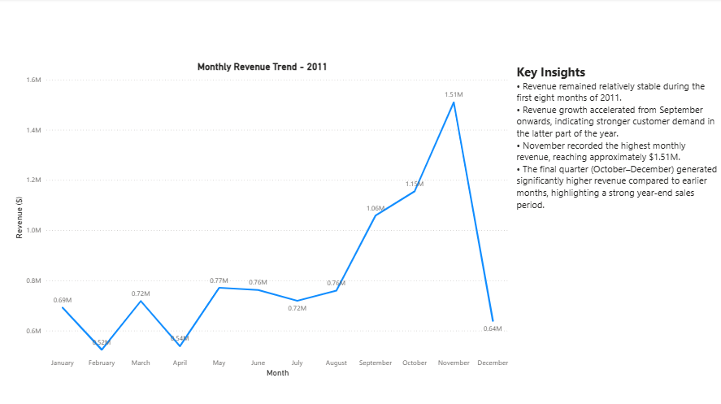
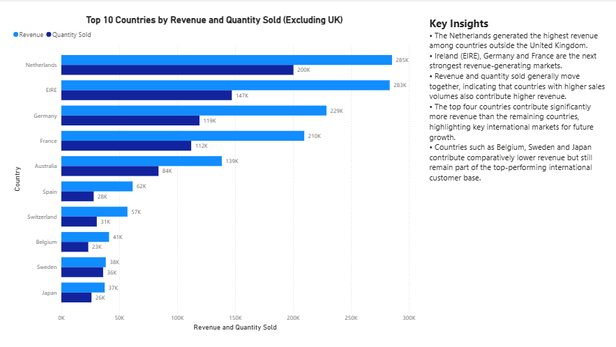
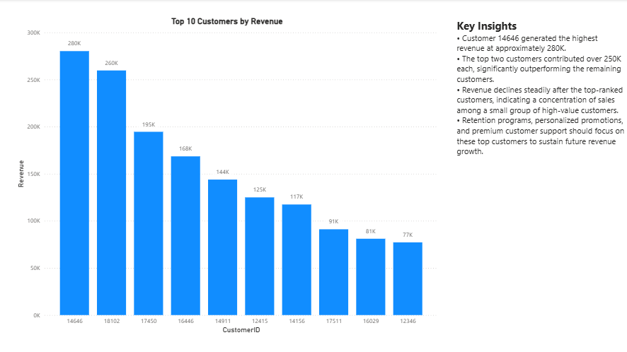
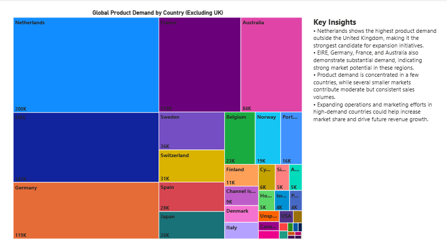

# Tata Data Visualisation - Forage

## Project Overview

Completed the Tata Data Visualisation: Empowering Business with Effective Insights Job Simulation by Forage.

This project focuses on analyzing retail sales data using Power BI and presenting business insights through interactive dashboards.

## Tools Used

- Power BI
- Excel
- Data Cleaning
- Data Analysis
- Data Visualization

## Dashboard Visualizations

### Q1 - Monthly Revenue Trend

### Q2 - Top Customers by Revenue

### Q3 - Top 10 Customers by Revenue

### Q4 - Product Demand by Country

## Key Insights

- Revenue increased significantly during the final months of the year.
- A small number of customers generated a large percentage of total revenue.
- Product demand was highest in the Netherlands, EIRE, Germany, France, and Australia outside the United Kingdom.
- These countries present strong opportunities for business expansion.

## Skills Demonstrated

- Power BI
- Data Analysis
- Business Intelligence
- Dashboard Development
- Data Visualization
- Data Cleaning
- Business Communication

## Certificate

Completed the Tata Data Visualisation Job Simulation offered by Forage.
